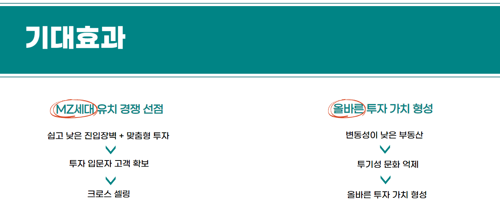
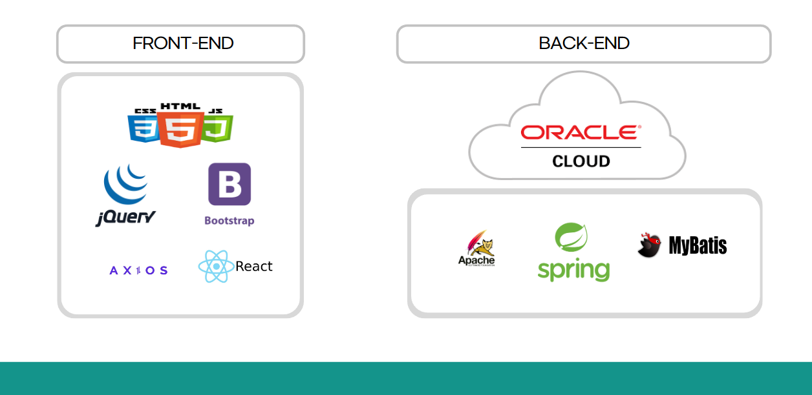
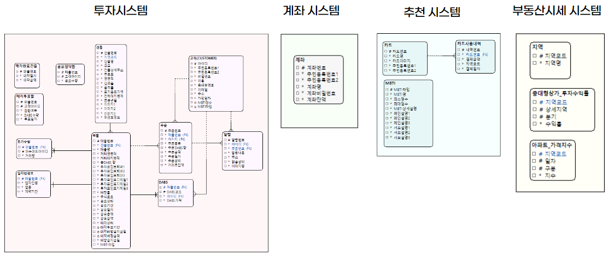
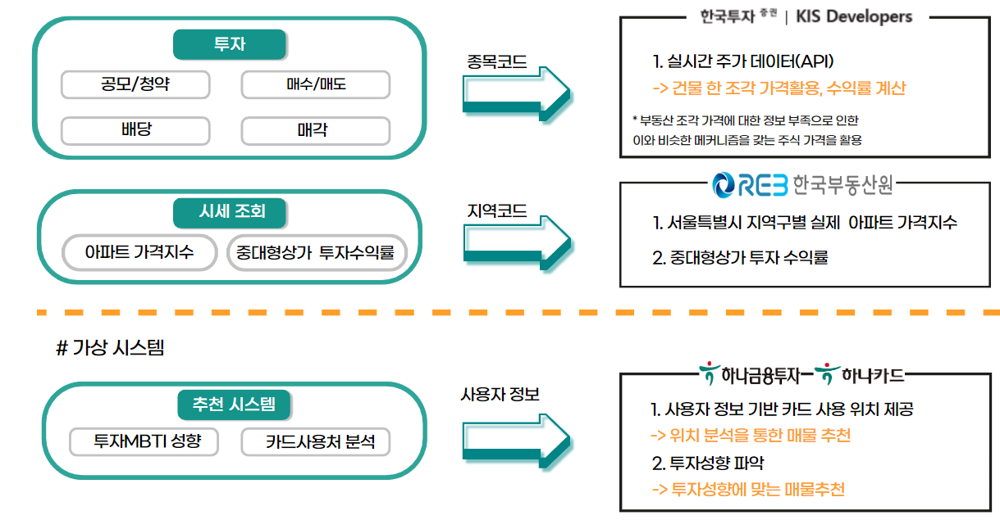

# 하나랜드 - 투자성향 MBTI,카드 사용처 분석을 통한 맞춤형 매물 추천 부동산 조각투자 

[**하나랜드 깃허브 홈페이지**](https://koposoftware.github.io/2022_13_hjjeon/)

## 1. 프로젝트 소개

### 1.1 프로젝트 개요
[프로젝트 제안서 PPT ](/intro.pptx)<br>

- 부동산조각투자: 다수의 투자자가 디지털화한 부동산의 유동화 수익증권(DABS)을 투자·거래하는 투자 플랫폼

- 일반 개인이 접근하기 어려웠던 부동산에 쉽게 재테크할 수 있는 플랫폼 서비스

### 1.2 프로젝트 목적

1) Spring Framework를 통한 MVC 패턴 웹 개발

2) 대학생, 회사원, 엄마, 아빠 누구나 손 쉽게 부동산에 투자하고, 건물수익에 대한 주권을 갖고 우리가 사는 도시 그리고 자산에 대한 관여도 상승 목표

### 1.3 프로젝트 기대효과


### 1.4 개발 환경 

```
- OS : macOS Monterey
- Framework : Spring, React
- Server : tomcat9
- Tool : Eclipse, Sql Developer, Visual Studio Code, Github
- DBMS : Oracle DBMS
```

### 1.5 수행 기간 

```
- 2022. 09. 26 ~ 2022. 10. 16
- 아이디어 및 설계 (09.16 - 09.23)
- 개발환경 세팅 및 DB 구축 (09.24-09.28)
- 개발 (09.28 - 10.15)
- 테스트 및 수정 (10.16 - 10.22)
```

## 2. 프로젝트 구성

### 2.1 시스템 아키텍처


### 2.2 ERD


### 2.3 서비스 아키텍처


## 3. 프로젝트 결과

### 3.1 발표PPT

### 3.2 시연 영상

## 4. 자기소개

|이름 |전형진||
|:---:|:---:|:---:| 
|연락처 |gudwls970412@gmail.com|
|skill set| Language & Tools - python,java,javascript,html,css|
| | Database - oracle|
| | Framework - spring,react,django|
|자격증| 2021년 정보처리기사 |
|| 2021년 SQLD |
|대외활동| 멋쟁이사자처럼 - django,react를 활용한 웹 개발 프로그래밍 신입 동아리원 멘토링(2020.05 – 2021.12)|
