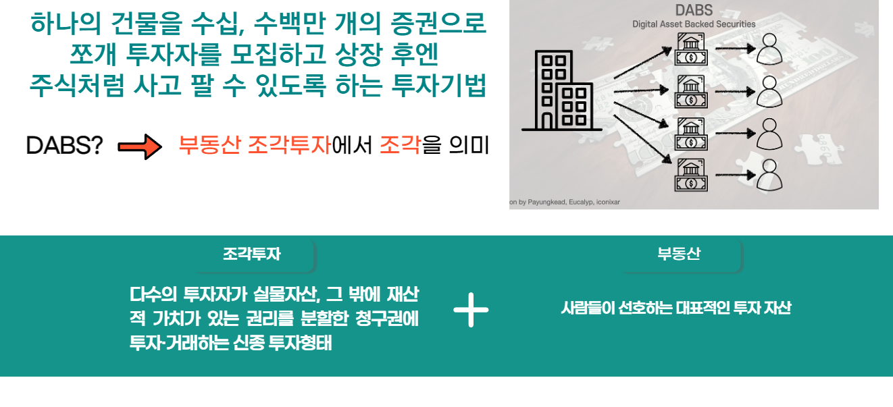

# 하나랜드 - 투자성향 MBTI,카드 사용처 분석을 통한 맞춤형 매물 추천 부동산 조각투자 

[**하나랜드 깃허브 홈페이지**](https://koposoftware.github.io/2022_13_hjjeon/)

## 1. 프로젝트 소개

### 1.1 프로젝트 개요



- 부동산조각투자: 다수의 투자자가 디지털화한 부동산의 유동화 수익증권(DABS)을 투자·거래하는 투자 플랫폼

- 일반 개인이 접근하기 어려웠던 부동산에 쉽게 재테크할 수 있는 플랫폼 서비스

### 1.2. 프로젝트 목적

1) Spring Framework를 통한 MVC 패턴 웹 개발

2) 대학생, 회사원, 엄마, 아빠 누구나 손 쉽게 부동산에 투자하고, 건물수익에 대한 주권을 갖고 우리가 사는 도시 그리고 자산에 대한 관여도 상승 목표

### 1.3 개발 환경 

```
- OS : macOS Monterey
- Framework : Spring, React
- Server : tomcat9
- Tool : Eclipse, Sql Developer, Visual Studio Code, Github
- DBMS : Oracle DBMS
```

|이름 |전형진||
|:---:|:---:|:---:| 
|연락처 |2260341017(@)kopo.ac.kr|
|skill set| Frontend - HTML, CSS, Javascript|
| | Backend - Python, Djago|
|자격증| 2021년 정보처리기사 |
|| 2021년 SQLD |
|오픽|  OPIC IM2|


## 2. 나의 소개 발표 동영상
GitHub 과제 동영상입니다.
<iframe width="887" height="499" src="https://www.youtube.com/embed/H37v4h77ty4" title="YouTube video player" frameborder="0" allow="accelerometer; autoplay; clipboard-write; encrypted-media; gyroscope; picture-in-picture" allowfullscreen></iframe>


 
[자기소개 발표 자료](/project.pptx)<br>

## 3. 코딩 경험

||언어|
|:---:|:---:| 
|1 |C|
|2|Python|
|3|JavaScript|


## 관련 링크 
### [전형진의 github](https://github.com/hyeongjin97)
